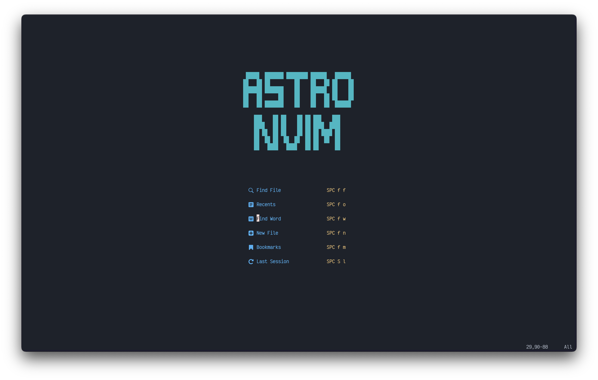

<!-- Readmeify - @readmeify/docs -->

<!-- Top section -->

  
   
  <h1 align="center" >Starsuite</h1>
  <h3 align="center" >My awesome <code>dotfiles</code>.</h3>

 

<!-- Table of contents -->
# 🧂 Table of Contents
- [🧂 Table of Contents](#-table-of-contents)
- [📡 Installing](#-installing)
- [🌅 Screenshots](#-screenshots)
- [🚀 Contributing](#-contributing)

<!-- Main Usage -->
# 📡 Installing
To install, make sure you have [Starship](https://starship.rs) and [Wezterm](https://wezfurlong.org/wezterm/) installed. Then, all you have to do is `git clone https://github.com/bluefalconhd/starsuite && cd ./starsuite/installer/` and run `bash install.sh` whenever you are ready to install. This preserves your current `starship.toml` and `wezterm/` located in the `~/.config` directory to `~/.config/.starsuite_backups`.

# 🌅 Screenshots

> Wezterm

> Starship prompt.

# 🚀 Contributing
Please use conventional commits when contributing! Thats all!

<!-- Footer  -->

  
    👼
    <a href="https://github.com/bluefalconhd">@bluefalconhd</a>
  
  ⁄
  
    <a href="https://github.com/bluefalconhd/starsuite">starsuite</a>
  
  •
  👮 MIT License
  •
  <a href="#-table-of-contents">Jump to Top</a>

